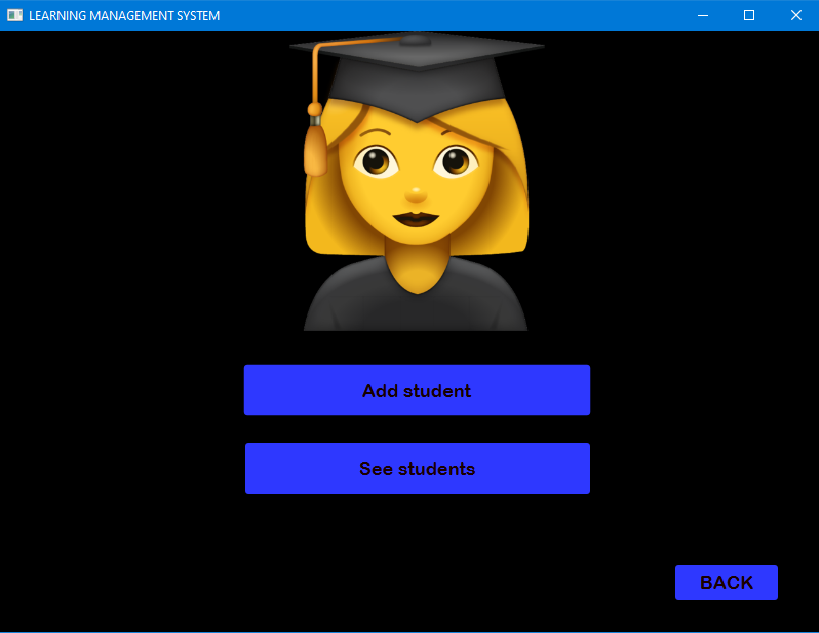
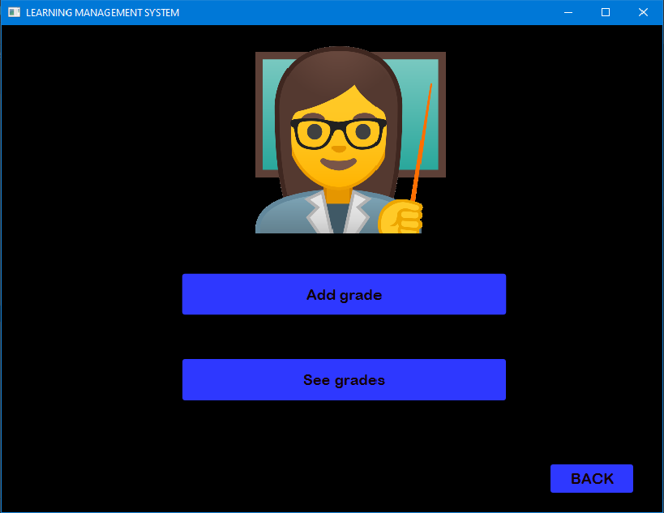

# Learning-Management-System
This project contains the management of the students and the teachers of an university allowing access to the grades, list of the teachers and list of the students which are loaded from data base. Grades, students and teachers can be added in the data base. The data base is made with MySQL.

## MainWindow Image

## StudentWindow Image

## TeacherWindow Image

## AdminWindow Image

